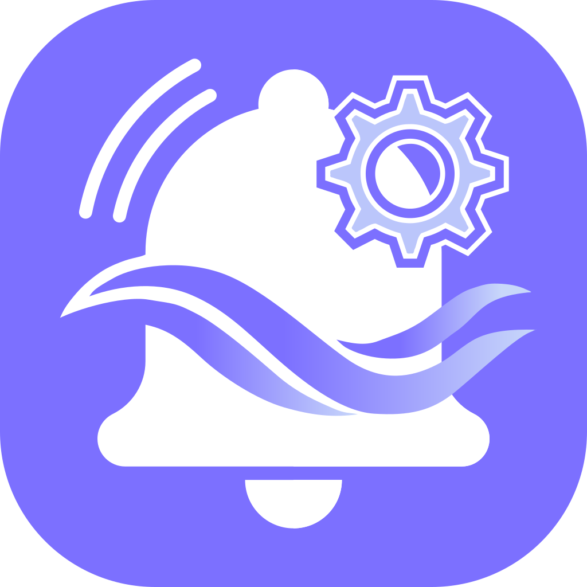

<p align="center">
  
</p>

<h1 align="center">NotiFlow</h1>

<p align="center">
  <strong>Fine-grained control over when and how Android notifications reach you.</strong>
</p>

NotiFlow is a free and open-source Android application that lets you create rules to control notifications on your device.

Instead of simply enabling or disabling notifications for an entire app, NotiFlow can identify notifications by application, title, content, regular expression, or advanced expression, then decide what should happen to them and when.

> **Project status:** NotiFlow is under active development. The `notiflow-dev` branch contains the current NotiFlow development version.

## Features

### 🎯 Flexible notification matching

Create rules for specific applications and choose how notifications should be matched:

- All notifications from an application
- Notification title
- Notification content
- Title **or** content
- Title **and** content
- Regular expressions (regex)
- Advanced logical expressions for more complex matching

This makes it possible to create anything from a simple “apply this rule to every notification from this app” rule to much more precise filters.

### ⚙️ Notification actions

When a notification matches a rule, NotiFlow can:

1. Dismiss it 🚫
2. Tap/open it ✅
3. Tap one of its action buttons 🔽️
4. Delay (snooze) it ⏳
5. Collect notifications into batches 📦
6. Debounce repeated notifications ❄️
7. Silence it 🔇
8. Play an alert 🔔
9. Disable Do Not Disturb 🔊
10. Remove it after a delay ⏲️
11. Replace it with a custom notification 📝

### ⏰ Advanced scheduling

Rules can be restricted to specific times of the week.

NotiFlow supports **multiple independent time ranges for each day**, allowing schedules such as:

```text
Monday–Friday
00:00 → 09:00
19:00 → 24:00

Saturday–Sunday
00:00 → 24:00
```

There is no fixed limit to the number of time ranges you can add to a day.

For delayed notifications, Android keeps the notification snoozed until the end of the currently active time range. When it returns, NotiFlow evaluates the notification again, so consecutive or all-day ranges continue to behave consistently.

### 🧾 History and controls

NotiFlow keeps useful notification information locally and includes tools inherited from NotiFilter for managing filters and notification history.

Home-screen widgets can also provide quick access to filter controls and notification information.

### 📂 Import and export

Rules can be exported to JSON and imported again, making it easier to back up or transfer a NotiFlow configuration.

### 🌍 Languages

NotiFlow currently includes:

- English 🇬🇧
- French 🇫🇷
- System language selection

The language can be changed directly from the application settings.

## 🔐 Privacy

NotiFlow is designed to work locally on your Android device.

- No ads
- No subscriptions
- No in-app purchases
- No account required
- Notification processing is performed on-device
- Open-source code

Because notification rules require access to notification content, Android will ask you to grant NotiFlow **Notification Access**. This permission is essential for the application to inspect and manage notifications according to your rules.

See [privacy.md](privacy.md) for the project's privacy information.

## 📦 Application variants

NotiFlow uses separate Android application IDs for development and release builds, allowing them to coexist on the same device:

| Variant | Application ID | Name |
| --- | --- | --- |
| Release | `com.bywilfried.notiflow` | NotiFlow |
| Nightly / development | `com.bywilfried.notiflow.dev` | NotiFlow-dev |
| Debug | `com.bywilfried.notiflow.debug` | NotiFlow |

Development and release builds are signed independently from the original NotiFilter application and therefore do not replace an existing NotiFilter installation.

## 🔎 APK signature verification

Official NotiFlow development and release APKs are signed with the same NotiFlow signing certificate.

**SHA-256 fingerprint of the signing certificate:**

```text
30:59:E0:18:84:D0:E7:2E:CB:E3:8E:68:35:28:99:D3:17:6F:8E:86:6E:F3:E3:AF:5C:02:6F:83:55:99:2D:84
```

Certificate subject:

```text
CN=NotiFlow, OU=Android Release, O=NotiFlow
```

This certificate fingerprint remains the same across future APK builds as long as they are signed with the official NotiFlow signing key. The SHA-256 of the APK file itself is different for each build and is therefore not used here as the permanent project identity.

## 🛠️ Building

The project is an Android/Gradle project. GitHub Actions can build the development and release APK variants from the repository workflow.

The development version lives on the `notiflow-dev` branch.

Prebuilt APK availability may change while the project is still under development. Always verify that you are downloading builds from this repository:

**https://github.com/bywilfried/NotiFlow**

## 🌱 About the project

NotiFlow is an independent fork of **NotiFilter**, originally created by Aditya Rajput / BURG3R5.

Original project:

**https://github.com/BURG3R5/NotiFilter**

NotiFlow keeps the powerful rule-based notification management foundation of NotiFilter while expanding it with features such as more flexible scheduling, multiple time ranges per day, application-wide notification matching, additional localization work, independent branding, and continued experimentation around notification control.

The original NotiFilter wiki remains a useful reference for functionality inherited from the upstream project:

**https://github.com/BURG3R5/NotiFilter/wiki**

## 📜 License

NotiFlow is free and open-source software licensed under the **GNU General Public License v3.0 (GPLv3)**, in accordance with the license of the original NotiFilter project.

See the [license](license) file for the complete license text.

Contributions and improvements are welcome.